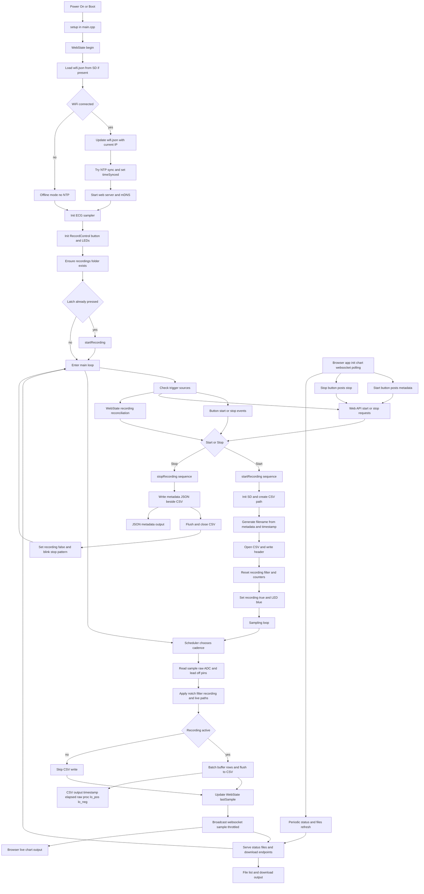

# Canine ECG / HR Measurement solution for behavior experiments

This project is being developed to provide an easy to use method for collecting ECG data and Heart Rate measurement through R-peak detection.

The main workflow uses a custom built portable ECG device (AD8232) module. But it also contains solutions for adapting a commercially available Polar H10 pulse monitoring belt.

## AD8232 on ESP32 (Arduino Nano remake)
### Features

- [ ] A cross-platform user interface is available to set up
    - [ ] recording metadata (eg. file name, subject name, test condition)
    - [ ] optional quasi-live streaming of data for monitoring purposes (the device can run without this)
- [x] On board button triggers the start and end of ECG data recording (ON / OFF)
- [ ] Board clock syncs with lab wifi before the experiment starts (UNIX time)
- [x] ECG module (AD8232) collects ECG data 
- [x] Data is written to an SD card 
- [ ] Board is powered by a chargable Li-ion battery pack

### Wiring
#### ECG module
|AD8232 |ESP32  |Comment                    | 
|-------|-------|---------------------------|
|GND    |GND    |ground                     |
|3v3    |3v3    |kraft                      |
|OUTPUT |A0     |analog                     |
|LO-    |D3     |Lead Off detection         |
|LO+    |D2     |Lead Off detection         |
|SDN    |-      |unconnected                |

#### SD card module
|SD     |ESP32  |Comment                                    | 
|-------|-------|-------------------------------------------|
|3v3    |3v3    |kraft                                      |
|CS     |D10    |Chip Select / fro SPI                      |
|MOSI   |D11    |ESP32 > SD card data                       |
|CLK    |D13    |Clock / timing signal for data transfer    |
|MISO   |D12    |SD card data  > ESP32                      |
|GND    |GND    |ground                                     |

> Note: AFAIK the digital pins are not arbitrary, although they can be modified later.
> Note2: OMG, I don't believe that MOSI and MISO were not cancelled yet.

#### SD card module
|SD     |ESP32  |Comment                                    | 
|-------|-------|-------------------------------------------|
|3v3    |3v3    |kraft                                      |
|CS     |D10    |Chip Select / fro SPI                      |
|MOSI   |D11    |ESP32 > SD card data                       |

#### Push Button Latch
|button |ESP32  |Comment                                    | 
|-------|-------|-------------------------------------------|
|NO     |D4     |Normally Open                              |
|COM    |GND    |Middle pin                                 |
|NC     |       |Normally Closed (unconnected               |

#### ESP32 board pins (note for self)
|PIN    |Stands for     |Comment                    | 
|-------|---------------|---------------------------|
|TX1    |transmit       |UART transmission          | 
|RX0    |receive        |UART reception             | 
|RST    |reset          |                           | 
|GND    |ground         |                           | 
|D2     |digital        |general (LO-)              |   
|D3     |digital        |general (LO+)              |
|D4     |digital        |general (push button latch)|
|D5     |digital        |general                    |
|D6     |digital        |general                    |
|D7     |digital        |general                    |
|D8     |digital        |general                    |
|D9     |digital        |general                    |
|D10    |digital        |reserved for CHIP SELECT   |
|D11    |digital        |reserved for MOSI          |
|D12    |digital        |reserved for MISO          |
|D13    |digital        |reserved for CLOCK         |
|3V3    |kraft          |3.3V                       |
|B0     |boot           |                           |
|A0     |analog         |                           |
|A1     |analog         |                           |
|A2     |analog         |                           |                           
|A4     |analog         |                           |
|A5     |analog         |                           |
|A6     |analog         |                           |
|A7     |analog         |                           |
|VBUS   |USB power      |5V                         |
|B1     |boot           |                           |
|GND    |ground         |                           |
|VIN    |voltage input  |                           |

## POLAR DATA STREAM
> This part is currently not developed as the custom built solutions proved to be more suitable. 

This pipeline was developed to get ECG and accelerometer data from a Polar H10 HR belt for BARKS Lab. 

1. Change settings at `settings.yaml`
2. Run `polar_data_stream.py`.
3. Collect your output `csv` from the `outputs` directory.

Ignore `utils.py` (unless you know what you are doing).

That's it. 

## Functionality

- Gathers packages of accelerometer data (x, y, z axes) and heart rate service data. 
- It creates a new `csv` file. Then appends data at given intervals to avoid complete data loss if something goes awry. 
- It automatically stops at a set length for safety. However, it also listens to stop signal from the user.
- It has a GUI for ease of use. 

> BELOW THIS LINE EVERYTHING IS OBSOLETE

## What are the files for (polar10 directory)

### belts.yaml
This contains info about the individual belts. Later this will be used to access the selected belts.

### bleak_test.py
This is a quick test to see if the bluetooth works, what devices are found, etc. Not too important. Will be deprecated soon.

### hr_belt_access.py
Connects to a given belt and it lists all the available services.

### read_hr_stream.py
Reads the heart rate stream. It was used for testing purposes.

